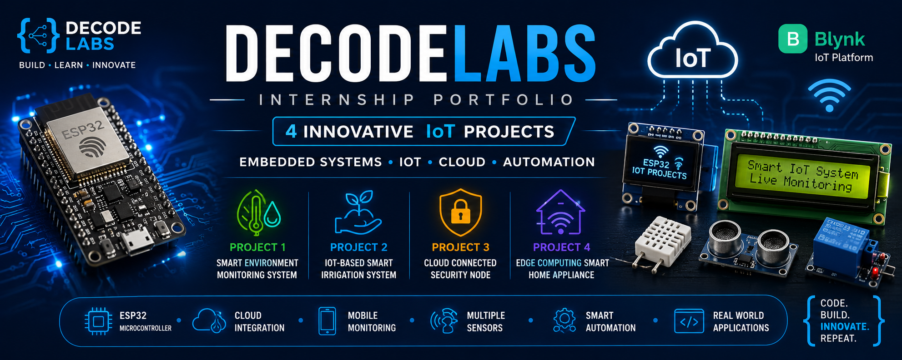

# 🚀 DecodeLabs Internship Portfolio

<div align="center">

# 🌍 ESP32 IoT Projects Collection

### Smart Environment Monitoring • Smart Irrigation • Cloud Security • Smart Home Appliance Security

<p align="center">

</p>


</div>

---

# 📖 About Repository

This repository contains four **ESP32-based IoT projects** developed during the **DecodeLabs Internship**. Each project demonstrates practical implementation of **Embedded Systems, IoT, Cloud Computing, Sensor Integration, Automation, and Real-Time Monitoring** using the ESP32 microcontroller.

The projects are developed using **Arduino C++**, simulated using **Wokwi**, and integrated with **Blynk IoT Cloud** wherever cloud connectivity is required.

---

# 📂 Repository Projects

| Project | Description |
|----------|-------------|
| 🌍 Smart Environment Monitoring System | Real-time monitoring of environmental conditions including temperature, humidity and air quality. |
| 🌱 IoT-Based Smart Irrigation System | Automated irrigation system based on soil moisture sensing and IoT monitoring. |
| 🔐 Cloud Connected Security Node | Smart security system with cloud telemetry, intrusion detection and remote monitoring. |
| 🏠 Edge Computing Smart Home Appliance | ESP32-based IoT system for temperature, humidity and gas monitoring with relay control, servo automation, OLED/LCD display and Blynk cloud monitoring. | 

---

# 🌍 Project 1 — Smart Environment Monitoring System

## 📷 Project Preview

<p align="center">

</p>

---

## 📖 Overview

The **Smart Environment Monitoring System** is an ESP32-based IoT solution designed to continuously monitor environmental conditions such as **temperature, humidity, and air quality**. The system provides real-time sensor readings through an OLED display while generating alerts whenever abnormal environmental conditions are detected. The collected data can also be monitored remotely using the **Blynk IoT Cloud**.

---

## ✨ Key Features

- 🌡 Real-Time Temperature Monitoring
- 💧 Humidity Detection
- 🌫 Air Quality Monitoring
- 📟 OLED Live Display
- 🌈 RGB Status Indicator
- 🔔 Smart Alert System
- ☁️ Cloud Monitoring using Blynk
- 📊 Live Sensor Visualization
- ⚡ Low Power ESP32 Architecture

---

## 🛠 Hardware Components

- ESP32 DevKit V1
- DHT22 Temperature & Humidity Sensor
- MQ2 Gas Sensor
- OLED Display (SSD1306)
- RGB LED
- Active Buzzer
- Breadboard
- Jumper Wires

---

## ⚙ Technologies Used

- ESP32
- Arduino IDE
- Arduino C++
- Wokwi Simulator
- Blynk IoT
- Embedded Systems

---

## 🚀 Working Principle

1. ESP32 continuously reads temperature, humidity and gas sensor values.
2. Environmental data is processed in real time.
3. OLED displays live sensor readings.
4. RGB LED indicates normal and warning conditions.
5. Buzzer activates whenever dangerous thresholds are exceeded.
6. Sensor values are transmitted to the Blynk IoT Cloud.
7. Users can monitor the complete system remotely through the Blynk mobile application.

---

## 🎯 Applications

- Smart Homes
- Laboratories
- Offices
- Environmental Monitoring
- Industrial Safety
- Smart Buildings

---

## 🔗 Wokwi Simulation

> Paste your Wokwi Project Link here.

---
# 🌱 Project 2 — IoT-Based Smart Irrigation System

## 📷 Project Preview

<p align="center">

</p>

---

## 📖 Overview

The **IoT-Based Smart Irrigation System** is an ESP32-powered smart agriculture solution that automates irrigation using real-time soil moisture and environmental monitoring. The system continuously analyzes soil conditions and intelligently controls irrigation to reduce water wastage while improving crop productivity. Cloud connectivity through **Blynk IoT** enables remote monitoring and control from anywhere.

---

## ✨ Key Features

- 🌱 Automatic Irrigation Control
- 💧 Real-Time Soil Moisture Monitoring
- 🌡 Temperature & Humidity Monitoring
- 🚰 Intelligent Water Pump Automation
- 📟 OLED/LCD Live Status Display
- ☁️ Blynk Cloud Integration
- 📱 Remote Monitoring & Control
- 🌈 RGB LED Status Indicator
- 🔔 Smart Alert Notifications
- ⚡ Low Power ESP32 Architecture

---

## 🛠 Hardware Components

- ESP32 DevKit V1
- Soil Moisture Sensor
- DHT22 Temperature & Humidity Sensor
- Relay Module
- Water Pump (Simulated)
- OLED Display (SSD1306)
- LCD1602 I2C Display
- RGB LED
- Active Buzzer
- Breadboard
- Jumper Wires

---

## ⚙️ Technologies Used

- ESP32
- Arduino IDE
- Arduino C++
- Wokwi Simulator
- Blynk IoT
- Embedded Systems
- IoT Automation

---

## 🚀 Working Principle

1. The soil moisture sensor continuously measures the moisture level of the soil.
2. ESP32 processes the sensor readings and compares them with predefined threshold values.
3. When the soil becomes dry, the relay module automatically activates the irrigation pump.
4. Once sufficient moisture is detected, the pump is switched OFF automatically.
5. Temperature and humidity are monitored simultaneously using the DHT22 sensor.
6. Live system status is displayed on the OLED and LCD displays.
7. Sensor data is uploaded to the Blynk IoT Cloud for real-time remote monitoring.
8. Users can monitor irrigation status anytime using the Blynk mobile application.

---

## 🎯 Applications

- 🌾 Smart Agriculture
- 🌱 Greenhouses
- 🌿 Home Gardens
- 🚜 Farms
- 💧 Water Conservation Systems
- 🌍 Precision Irrigation

---

## 🔗 Wokwi Simulation

> Paste your Wokwi Project Link here.

---
# 🔐 Project 3 — Cloud Connected Security Node

## 📷 Project Preview

<p align="center">
  
</p>

---

## 📖 Overview

The **Cloud Connected Security Node** is an advanced **ESP32-based IoT security solution** designed to provide intelligent surveillance, real-time monitoring, and cloud connectivity. The system combines **intrusion detection, keypad authentication, servo-based door locking, environmental monitoring, OLED/LCD visualization, and Blynk cloud telemetry** into a single smart security platform.

It continuously monitors the surroundings, generates instant alerts during suspicious activities, and allows users to remotely monitor the system using the **Blynk IoT platform**.

---

## ✨ Key Features

- 🚨 Intrusion Detection System
- ☁️ Blynk Cloud Integration
- 📡 Real-Time IoT Telemetry
- 🔑 Password-Based Keypad Authentication
- 🔒 Servo Controlled Smart Door Lock
- 📏 Ultrasonic Distance Detection
- 👁 PIR Motion Detection
- 🌡 Temperature & Humidity Monitoring
- 📟 OLED Live Sensor Display
- 🖥 LCD1602 Status Display
- 🌈 RGB Security Status Indicator
- 🔔 Smart Alarm & Buzzer Notification
- 📱 Remote Monitoring from Mobile
- ⚡ ESP32 Wi-Fi Connectivity

---

## 🛠 Hardware Components

- ESP32 DevKit V1
- HC-SR04 Ultrasonic Sensor
- PIR Motion Sensor
- DHT22 Sensor
- 4×4 Matrix Keypad
- Servo Motor
- OLED Display (SSD1306)
- LCD1602 I2C Display
- RGB LED
- Active Buzzer
- Breadboard
- Jumper Wires

---

## ⚙️ Technologies Used

- ESP32
- Arduino IDE
- Arduino C++
- Wokwi Simulator
- Blynk IoT
- Embedded Systems
- Cloud Telemetry

---

## 🚀 Working Principle

1. ESP32 continuously monitors all connected sensors.
2. PIR sensor detects human motion.
3. Ultrasonic sensor measures the distance of nearby objects.
4. Users authenticate through the 4×4 keypad.
5. Upon successful authentication, the servo motor unlocks the door.
6. OLED and LCD display live system information.
7. RGB LED indicates SAFE, WARNING, or ALERT status.
8. The buzzer activates whenever an intrusion is detected.
9. Sensor readings are transmitted to the Blynk IoT Cloud.
10. Users can monitor the complete security system remotely using the Blynk mobile application.

---

## 📊 Cloud Telemetry

The system publishes live IoT data including:

- 🌡 Temperature
- 💧 Humidity
- 📏 Distance
- 👁 Motion Detection Status
- 🚨 Alarm Status
- 🔒 Door Lock Status
- 📈 Intrusion Count

---

## 🎯 Applications

- 🏠 Smart Home Security
- 🏢 Office Security
- 🏭 Industrial Monitoring
- 🛡 Access Control Systems
- 📡 Remote Surveillance
- 🌐 IoT Security Solutions

---

## 🔗 Wokwi Simulation

> Paste your Wokwi Project Link here.

---
# 🏠 Project 4 — Edge Computing Smart Home Appliance 

## 📷 Project Preview

<p align="center">
  
</p>

---

## 📖 Overview

The **Edge Computing Smart Home Appliance** is an ESP32-based IoT project that monitors temperature, humidity, and gas leakage while controlling home appliances using a relay and servo motor. The system displays real-time data on OLED and LCD displays and sends live sensor data to the Blynk IoT Cloud for remote monitoring.

---

## ✨ Key Features

- ☁️ Blynk Cloud Monitoring
- 🌡️ Temperature & Humidity Monitoring
- 🔥 MQ2 Gas Leak Detection
- 🔌 Relay-Based Appliance Control
- ⚙️ Servo Motor Control
- 📟 OLED Live Display
- 🖥️ LCD Live Display
- 🌈 RGB LED Status Indicator
- 🚨 Smart Buzzer Alarm
- 📱 Remote Monitoring using Blynk

---

## 🛠 Hardware Components

- ESP32 DevKit V1
- DHT22 Sensor
- MQ2 Gas Sensor
- Servo Motor
- OLED Display (SSD1306)
- 16x2 LCD Display (I2c)
- Relay Module 
- RGB LED
- Active Buzzer
- Blynk IOT Platform
- Breadboard
- Jumper Wires

---

## ⚙️ Technologies Used

- ESP32
- Arduino IDE
- Arduino C++
- PlatformIO
- Wokwi Simulator
- Blynk IoT
- Embedded Systems

---

## 🚀 Working Principle

1. ESP32 reads temperature and humidity from the DHT22 sensor.
2. MQ2 continuously monitors gas concentration.
3. OLED and LCD display live sensor readings.
4. RGB LED indicates the current system status.
5. Buzzer activates when dangerous gas levels are detected.
6. Relay controls the connected appliance.
7. Servo motor performs automated control operations.
8. Sensor data is uploaded to the Blynk IoT Cloud.
9. Users can monitor the system remotely through the Blynk mobile application.
---

## 🎯 Applications

- 🏠 Smart Homes
- 🏢 Offices
- 🏭 Industries
- 🛡 Secure Access Control
- 🌐 IoT Automation

---

## 🔗 Wokwi Simulation

> Paste your Wokwi Project Link here.

---

# 📁 Repository Structure

```text
DecodeLabs-Internship/
│
├── README.md
├── Images/
│   ├── Banner.png
│   ├── Project 1.png
│   ├── Project 2.png
│   ├── Project 3.png
│   └── Project 4.png
│
├── Project-1-Smart-Environment-Monitoring/
├── Project-2-IoT-Smart-Irrigation/
├── Project-3-Cloud-Connected-Security-Node/
└── Project-4-Smart-Home-Appliance-Security/
```

---

# 💻 Software & Tools

- ESP32 DevKit V1
- Arduino IDE
- PlatformIO
- Wokwi Simulator
- Blynk IoT
- GitHub
- Visual Studio Code

---

# 📸 Project Gallery

## 🌍 Smart Environment Monitoring

<p align="center">

</p>


---

## 🌱 Smart Irrigation

<p align="center">

</p>

---

## 🔐 Cloud Connected Security Node

<p align="center">

</p>

---

## 🏠 Smart Home Appliance Security

<p align="center">

</p>

---

# 🚀 Getting Started

1. Clone this repository.
2. Open any project in **PlatformIO** or **Arduino IDE**.
3. Install the required libraries.
4. Build the project.
5. Upload the firmware to ESP32 or run the Wokwi simulation.
6. Configure Wi-Fi credentials and Blynk Authentication Token (if required).
7. Start monitoring and controlling the system.

---

# 🔮 Future Improvements

- 🤖 AI-Based Automation
- 📷 Face Recognition
- 🪪 RFID Authentication
- 👆 Fingerprint Door Lock
- ☁ Cloud Database Integration
- 📊 Analytics Dashboard
- 🔔 Push Notifications
- 🗣 Voice Assistant Integration
- 📡 OTA Firmware Updates

---

# 🎓 Internship

Developed during the **DecodeLabs Internship Program** as a collection of ESP32-based IoT and Embedded Systems projects.

---

# 👨‍💻 Author

## Vishal Mishra

- 🔧 ESP32 & IoT Developer
- 📡 Embedded Systems Enthusiast
- 💻 Arduino & PlatformIO Developer
- ☁️ Blynk IoT Developer
- 🎓 DecodeLabs Internship

---

# ⭐ Support

If you found this repository helpful:

⭐ Star this repository

🍴 Fork this repository

📢 Share it with others

---

# 📜 License

This repository is intended for **educational and learning purposes** under the DecodeLabs Internship Program.
# 🤝 Contributing

Contributions are always welcome!

If you'd like to improve these projects:

1. Fork this repository
2. Create a new feature branch
3. Commit your changes
4. Push your branch
5. Open a Pull Request

---

# 📬 Contact

<div align="center">

### 👨‍💻 Vishal Mishra

📡 ESP32 & IoT Developer

🎓 DecodeLabs Internship

⭐ GitHub: https://github.com/YOUR_USERNAME

📧 Email: your_email@example.com

</div>

---

<div align="center">

## ⭐ If you found this repository useful, don't forget to Star it!

Made with ❤️ using ESP32 • Arduino • PlatformIO • Wokwi • Blynk IoT

</div>
